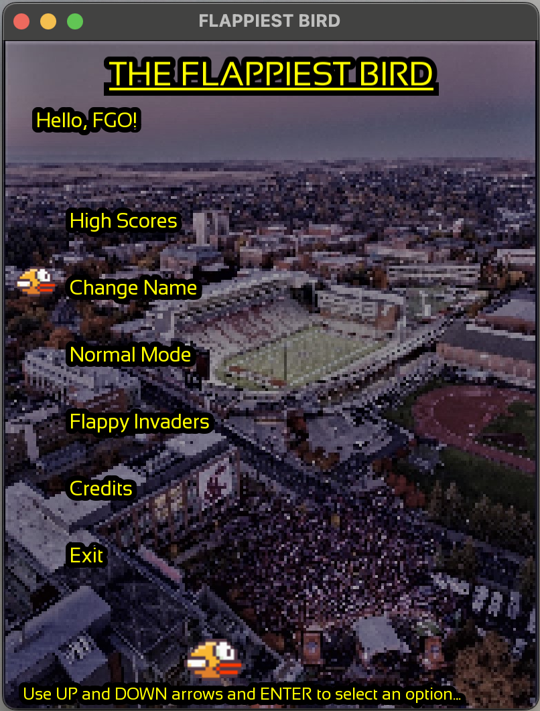

# Flappy_Bird


Welcome to the Flappiest Bird! This was a group project for Cpts 122 at Washington State
University. It was a very fun and educational experience to learn how to put together
and replicate such an iconic game.

# Features or Flappiest Bird

- Set your three letter acronym (TLA) to be put on the scoreboard when you beat an existing high score.
- View the top 10 high scores your local instance.
- Play the `Normal Mode` edition, which utilizes the same game-play as the original Flappy Bird
- Play the `Flappy Invaders` edition, placing you against enemy birds to shoot down.

## Main Menu
<figure>

</figure>

## High Scores
<figure>

</figure>

## Normal Mode
<figure>

</figure>

## Flappy Invaders
<figure>

</figure>

# Technology Used

Flappiest Bird relies on the following tools:

- [C++](https://cplusplus.com)
- [SFML](https://www.sfml-dev.org)
- [CMake](https://cmake.org)

My programming environment used the following:

- [XCode](https://developer.apple.com/xcode/)
- [VSCode](https://code.visualstudio.com) (for modifying the README)
- [NeoVim](https://neovim.io) (for introducing CMake)

# How to Build

The original version relied on an IDE to run the project. In my case it was XCode. In an effort to
make this project more easily runnable for more people, I introduced CMake to help manage the building
process.

- Clone the Repository
- Install SFML

    - On the [SFML Website](https://www.sfml-dev.org/download.php), there is a page to download the necessary files.
    In my case, on MacOS, I used [Homebrew](https://brew.sh) to install SFML.

    ```shell
    brew install sfml
    ```
- Build the Project
    - Feel free to build the project using whatever tools you feel comfortable with. However, you can use the
    CMake CLI to build the project.
    ```shell
    mkdir -p build && cd build
    cmake ..
    make
    ./Flappy-Bird
    ```
    - NOTE: you can run the executable from the project root directory or the build directory.
    The resource files are copied to the build folder, so they will be found if the executable
    is started from the build directory.

